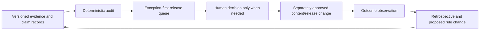

# Coreweaver Content Learning Loop

This directory is a portable, repository-based **closed-loop learning system for evidence quality**. It helps identify missing sources, stale claims, absent accountable review, and recurring release failures. It writes an exception-first queue so an operator only needs to decide on records that are blocked, due for recheck, or ready for a separately approved release action.

It is intentionally not a content factory. The loop has no CMS client, no publishing credentials, no model client, no GitHub write client, and no deployment client. It cannot publish, alter a Notion record, create a pull request, merge, deploy, delete public content, send provider prompts, or change DNS.

## Operating loop

## Commands

| Command | Output | External side effects |
|---|---|---|
| `npm run learning:audit` | A deterministic evidence and claim audit in `content-learning/runs/`. | None. |
| `npm run learning:queue` | A `hold`, `needs-decision`, or `observe` release queue. | None. |
| `npm run learning:retrospective` | A pattern summary from append-only outcome records. | None. |
| `npm run learning:run` | The three reports above. | None. |
| `npm run test:learning` | Contract and no-side-effect tests. | None. |

Generated run artifacts are excluded from Git. A scheduled workflow may run the commands and upload their output as an artifact, but it must not commit the outputs, create issues, open pull requests, update a CMS, or publish.

## Contracts

| Record | Role | Human responsibility |
|---|---|---|
| `evidence/*.json` | States exactly what a source supports, its limits, owner, and check date. | Decide whether the source is credible and current. |
| `claims/*.json` | Separates fact, interpretation, proposal, and promise. | Approve factual scope and any claim wording. |
| `proposals/*.json` | Describes a narrow hold, recheck, retirement, or revision task. | Explicitly approve any content or public-state action. |
| `outcomes/*.json` | Records dated observations and methods after a separately approved change. | Confirm that measurements are ethical, lawful, and correctly interpreted. |
| `input/current-blog-inventory.json` | A frozen audit snapshot, not a publishing input. | Update deliberately after a new read-only audit. |

## Rules that cannot be bypassed by a normal run

1. `safeMode` remains `true`; `cmsWrites`, `providerCalls`, `gitWrites`, `deployments`, and `publishing` remain `false`.
2. A claim cannot enter `release-ready` without the configured source count, limitation, accountable owner, evidence date, and human reviewer.
3. A time-sensitive claim cannot enter `release-ready` without a future recheck date.
4. Outcome records can report observations, not causal performance claims.
5. The loop may propose a new policy rule but may not alter policy.

See [`CONTRACTS.md`](./CONTRACTS.md) for field requirements and [`OPERATING_MODEL.md`](./OPERATING_MODEL.md) for authority boundaries.
